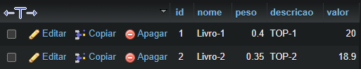
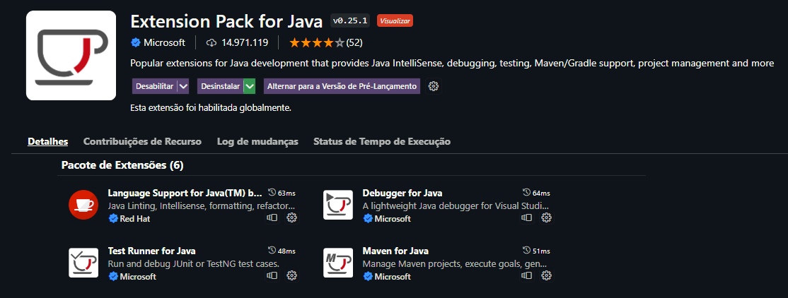
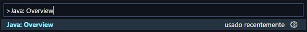
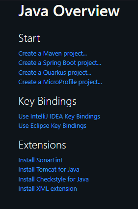

<h1 align="center">
  Sistema Livraria
</h1>

  	
  
	
  
  
  
  
  

---

DESCRIÇÃO

  Projeto desenvolvido em java com maven no ambiente vscode, o projeto interage com um banco de dados por meio de JPA (Java Persistence Api)   

&nbsp;

- Database

    

---
<h2 align="center">
  Como criar um projeto Maven com o VSCode?
</h2>

  

  

  

  

---

## :memo: License

This project is under the MIT license. See the [LICENSE](LICENSE) for details.